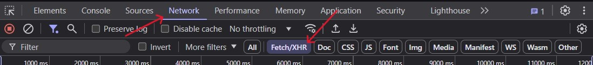
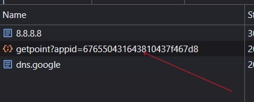
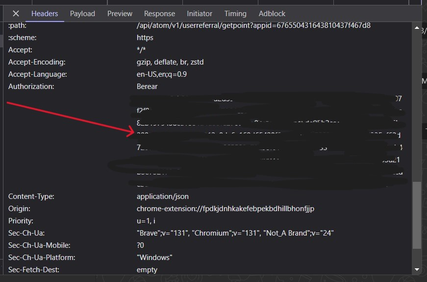
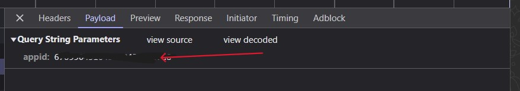

# Setup Guide

This project requires you to configure two JSON files: `accounts.json` and `proxy.json` before running the application.

## 1. Configure `proxy.json`

The `proxy.json` file should contain your proxy credentials. You need to replace the placeholder values with your actual proxy information.

### Example `proxy.json`:

```json
{
  "username": "xxx",
  "password": "xxx",
  "hostname": "xxx.xxx.com",
  "port": 1234
}
```

## 2. Configure `accounts.json`:

The accounts.json file contains a list of accounts that the application will use. Each account should have an email, appid, and token. Replace the placeholder values with your actual information.

### Example `accounts.json`:

```json
[
  {
    "email": "xxx@gmail.com",
    "appid": "xxx",
    "token": "xxx"
  },
  {
    "email": "xxx@gmail.com",
    "appid": "xxx",
    "token": "xxx"
  }
]
```

### How to get appid & token









## Install Dependencies

```bash
npm install
```

## Start the project

```bash
node index.js
```
